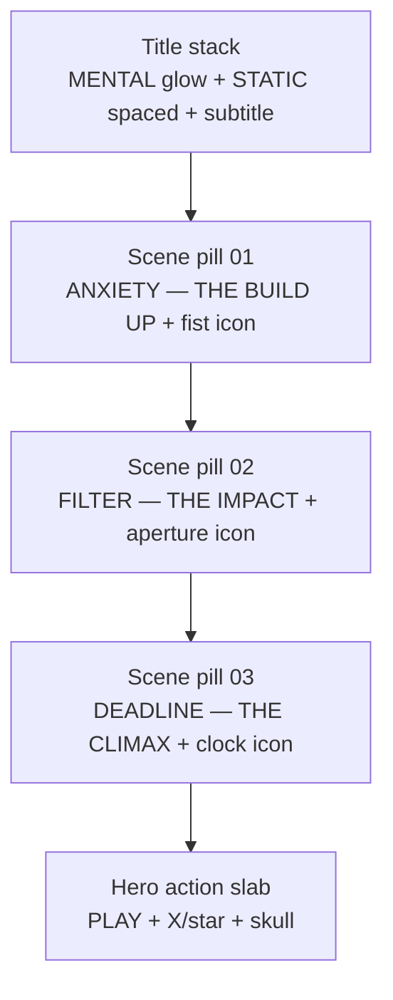
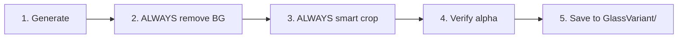
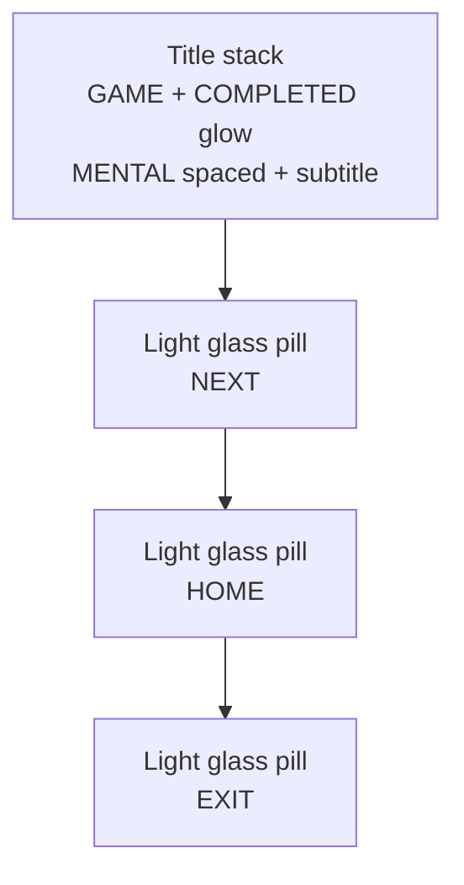

# Mental Static — Glass UI Style Guide

**Canonical screen reference:** [`Ref/main_menu_mental_static_ref.png`](Ref/main_menu_mental_static_ref.png)

This is the **only** UI style spec for WindowFracture. All new UI art must match this main menu mockup.

---

## Visual Identity

**"Mental Static — Fractured Glass UI"**

Dark, psychological, monochromatic. Glass is the core motif — tied to `GlassPanel` shatter gameplay. Two distinct glass tiers share the same cool charcoal family but differ in opacity and fracture intensity.

| Tier | Use | Material read |
|---|---|---|
| **Light glass pills** | Scene select, list rows, navigation panels | Smoky translucent capsule — subtle top rim highlight, minimal cracks |
| **Dark fractured slabs** | PLAY, NEXT, EXIT, RESUME, RETRY, HOME, CONTINUE | Thick opaque charcoal glass — dense fracture network, dry-brush white paint |

---

## Main Menu Layout (canonical composition)

Reference: [`Ref/main_menu_mental_static_ref.png`](Ref/main_menu_mental_static_ref.png)



### Screen structure (portrait mobile)

| Zone | Content | Alignment |
|---|---|---|
| **Header** | `MENTAL` (large, soft white glow) | Top center |
| | `S T A T I C` (letter-spaced, smaller) | Below title |
| | `A 3-SCENE EXPERIENCE` (thin subtitle) | Below static |
| **Scene list** | Three horizontal glass pills, equal width, stacked vertically | Center, ~55% screen height |
| **Hero action** | Dark fractured PLAY slab (largest button) | Bottom center, ~15% from bottom |
| **Accent** | Optional tiny sparkle (bottom-right of screen) | Decorative only |

### Spacing rules

- Equal vertical gap between scene pills (~8–12% of pill height)
- Scene pills ~75–85% of screen width
- PLAY slab ~90% of scene pill width, slightly taller aspect (~2.5:1)
- Title block occupies top ~18–22% of screen

---

## Tier 1 — Light Glass Scene Pills

Used for: scene select rows, level list items, settings rows (non-destructive navigation).

### Shape & material

| Property | Spec |
|---|---|
| **Shape** | Horizontal capsule / pill (~5:1 aspect) |
| **Material** | Smoky translucent dark glass — reads lighter than action slabs |
| **Edge** | Soft polished rim, bright highlight along top edge |
| **Cracks** | None or extremely faint — do **not** use heavy fracture on pills |
| **Shadow** | Soft drop shadow beneath pill (part of PNG alpha) |
| **Background** | Fully transparent outside pill |

### Internal layout (left → right)

| Slot | Width | Content |
|---|---|---|
| **Index circle** | ~12% | Dark glass circle, white number `01` / `02` / `03` |
| **Text block** | ~55% | Primary title (all caps, bold slab-serif) + subtitle below (smaller, muted) |
| **Icon circle** | ~18% | Dark glass circle, white line icon centered |

**Example rows (from main menu):**

| # | Primary | Subtitle | Icon |
|---|---|---|---|
| 01 | ANXIETY | THE BUILD UP | Clenched fist + static lines |
| 02 | FILTER | THE IMPACT | Camera aperture / shutter |
| 03 | DEADLINE | THE CLIMAX | Analog clock ~11:55 |

### Locked colors — light glass pills

| Token | Hex / value | Use |
|---|---|---|
| `PillGlassFace` | `#2E2E34` @ ~75% opacity | Capsule body |
| `PillGlassHighlight` | `#FFFFFF` @ ~25% opacity | Top rim sheen |
| `PillGlassShadow` | `#0A0A0C` @ ~40% opacity | Bottom depth inside pill |
| `PillCircleFill` | `#1E1E22` @ ~90% opacity | Number + icon circles |
| `PillTextPrimary` | `#F0F0F2` | Scene name (ANXIETY, FILTER, DEADLINE) |
| `PillTextSecondary` | `#9898A0` | Subtitle (THE BUILD UP, etc.) |
| `PillIconWhite` | `#F0F0F2` | Icons inside circles |
| `PillDropShadow` | `rgba(0,0,0,0.45)` offset `(0, 6px)` blur `14px` | Under pill |

### File naming — scene pills

```
panel_scene_{scene}_glass.png
```

Examples: `panel_scene_anxiety_glass.png`, `panel_scene_filter_glass.png`, `panel_scene_deadline_glass.png`

Target size after crop: ~**900×160** (aspect ~5.6:1)

---

## Tier 2 — Dark Fractured Action Slabs

Used for: PLAY, NEXT, EXIT, RESUME, RETRY, HOME, CONTINUE, and square icon-only buttons.

**Material reference for generation:** [`btn_play_glass.png`](btn_play_glass.png) (PLAY slab from main menu).

Also valid layout reference: [`btn_next_glass.png`](btn_next_glass.png) (same glass material, label-only layout).

### Shape & material

| Property | Spec |
|---|---|
| **Material** | Thick dark charcoal fractured **glass slab** — NOT stone, NOT metal |
| **Depth** | 3D beveled chipped edges, subtle top-left sheen |
| **Surface** | Fine white **fracture crack network** (sharp glass cracks, low–medium density) |
| **Paint** | **Dry-brush hand-painted white** — worn bristle texture, charcoal shows through at paint edges |
| **Shadow** | Soft drop shadow under slab (semi-transparent, part of PNG alpha) |
| **Background** | Fully transparent outside button shape |

### Layout variants

| Type | Aspect | Layout | Examples |
|---|---|---|---|
| **Hero action** | ~2.7:1 | Center label + optional flanking icons | PLAY (X/star left, skull right) |
| **Wide label only** | ~2.7:1 | Centered text, chevrons inline | NEXT `>>>`, CONTINUE |
| **Wide text + icon** | ~3:1 | Label left (~65%), icon right (~30%) | EXIT, RESUME, RETRY, HOME |
| **Square icon** | ~1:1 | Icon centered | settings, shop, trophy |

**PLAY-only decorations:** X + star (left), skull (right). Do **not** copy these onto other action buttons unless specified.

### Locked colors — dark fractured slabs

| Token | Hex | Use |
|---|---|---|
| `GlassBase` | `#18181C` | Glass face |
| `GlassHighlight` | `#4A4A52` | Top-left edge chips |
| `GlassShadow` | `#0C0C0E` | Bottom-right depth |
| `FractureLine` | `#C0C0C8` | Crack lines |
| `PaintWhite` | `#F0F0F2` | Text + icons (same on every asset) |

**Rule:** Distress *shape* may vary; **brightness must not.** All letters and icons fully white — no gradient, fade, or black text.

### File naming — action buttons

```
btn_{action}_glass.png
icon_{name}_glass.png
```

Target size after crop: wide ~**601×226**, square ~**512×512**

---

## Title Typography (built in Unity or exported sprite)

| Element | Font style | Color / effect |
|---|---|---|
| `MENTAL` | Bold sans-serif (Bebas Neue) | `#FFFFFF` + soft outer glow `#B0D0E8` @ 40% |
| `STATIC` | Same family, letter-spaced (+20% tracking) | `#E8E8EC`, no glow |
| Subtitle | Light sans-serif, small caps feel | `#787880` |

Title is typically **Unity TMP**, not a baked sprite — use glow via Outline/Shadow material or URP bloom.

---

## Screen Background (full-screen only)

For menu scenes / mockups — **not** baked into individual button PNGs.

| Token | Value |
|---|---|
| `BgTop` | `#0E0E12` |
| `BgBottom` | `#050508` |
| `FloorReflection` | Subtle mirror of pills/buttons @ ~15% opacity |
| `AmbientGlow` | Cool white `#C8D8E8` @ 8% from top center |

Individual exported sprites remain **fully transparent** outside their shape.

---

## Post-Process Pipeline (mandatory for all exported sprites)



**Scene pills and action buttons both require steps 2–3.** Full-screen mockups in `Ref/` are reference only — do not post-process the composition reference.

### Step 2 — Remove BG

```powershell
& "W:\Unity\FreelanceProjects\WindowFracture\Assets\2D\UI\GlassVariant\PostProcess-GlassVariant.ps1" `
  -InputPath "<path-to-raw.png>" `
  -OutputPath "W:\Unity\FreelanceProjects\WindowFracture\Assets\2D\UI\GlassVariant\<output>.png"
```

- Threshold: max(R,G,B) ≤ 12, BFS flood fill from edges
- Smart crop: alpha bbox + **12px** padding

### Verify checklist

- [ ] All corners alpha = 0
- [ ] Full image border transparent
- [ ] Matches correct tier (light pill vs dark slab)
- [ ] Text/icons fully white and readable
- [ ] Test on colored Unity canvas — no gray rectangle
- [ ] `.meta`: Sprite (2D/UI), PPU 100, Alpha Is Transparency ON, no mipmaps

---

## Generation Prompt Templates

Attach **`Ref/main_menu_mental_static_ref.png`** for layout/composition context.
Attach **`btn_play_glass.png`** for dark slab material.
Attach an approved **`panel_scene_*_glass.png`** for pill material once first pill is approved.

### Scene pill template

```
Horizontal glass capsule UI panel, aspect ratio 5:1.
Light smoky translucent dark glass pill — polished top rim highlight, NO heavy fractures.
Left: dark glass circle with white number "{NUM}".
Center: bold all-caps "{TITLE}" in white #F0F0F2, subtitle "{SUBTITLE}" below in muted gray #9898A0.
Right: dark glass circle with white line icon of {ICON_DESC}.
Soft drop shadow beneath pill (part of alpha).
Fully transparent background, PNG with alpha. NO gray backdrop, NO checkerboard.
Match attached main_menu_mental_static_ref scene pill style exactly.
```

### Action button template

```
Wide horizontal UI game button, aspect ratio 3:1.
Clone attached btn_play_glass reference EXACTLY for glass material — smoky charcoal #18181C, 3D beveled chipped edges, fine white fracture crack network #C0C0C8, top-left sheen, soft drop shadow (part of alpha).

ONLY replace painted content:
{LAYOUT}

Text/icons: bold all-caps dry-brush hand-painted white #F0F0F2. Every letter fully visible white — NO gradient, NO fade.
Fully transparent background. NO stone, NO metal, NO studio backdrop.
```

**Negative prompt (both tiers):** stone, slate, metal, flat poster, torn paper, dense scribbles, gray/white/black background, checkerboard, color variation, gradient text, faded letters, black text

---

## Folder Structure

```
Assets/2D/UI/GlassVariant/
├── ASSET_GUIDE.md              ← this file
├── Ref/
│   └── main_menu_mental_static_ref.png   ← full screen composition lock
├── btn_play_glass.png          ← dark slab material lock
├── btn_next_glass.png          ← dark slab layout reference
├── panel_scene_anxiety_glass.png
├── panel_scene_filter_glass.png
├── panel_scene_deadline_glass.png
├── btn_{action}_glass.png
└── icon_{name}_glass.png
```

Unrelated flat vector icons stay in `Assets/2D/UI/Icons/` — not part of this glass set.

---

## Do / Don't

**Do:**
- Use [`main_menu_mental_static_ref.png`](Ref/main_menu_mental_static_ref.png) as the layout + tier definition
- Use light pills for scene/list navigation, dark slabs for primary actions
- Keep monochrome palette; only title glow may use subtle cool cyan
- ALWAYS remove BG + smart crop before saving sprites
- Match locked hex values across the full set

**Don't:**
- Mix pill and slab styles on the same button type
- Put heavy fracture cracks on scene pills
- Copy PLAY skull/X decorations onto non-PLAY buttons
- Bake backgrounds into individual sprite PNGs
- Vary base or paint brightness between assets in the same tier

---

## Level Complete Panel

**Composition reference:** [`Ref/panel_level_complete_mental_static_ref.png`](Ref/panel_level_complete_mental_static_ref.png)

Portrait layout matching main menu tone — dark grid/bokeh BG in scene, glass UI elements as sprites/TMP.



| Zone | Implementation |
|---|---|
| **Title** | Unity TMP — `GAME` / `COMPLETED` (Bebas Neue + cool glow), `M E N T A L`, `A 3-SCENE EXPERIENCE` |
| **Buttons** | Light glass pill sprites (Tier 1), stacked vertically, equal width/gap |
| **Background** | Scene canvas — `#0E0E12` → `#050508` gradient + optional subtle grid |

### Level complete button sprites

| File | Label |
|---|---|
| `panel_lc_btn_next_glass.png` | NEXT |
| `panel_lc_btn_home_glass.png` | HOME |
| `panel_lc_btn_exit_glass.png` | EXIT |

Target after crop: ~**900×160** (aspect ~5.6:1). Use light pill tier — translucent capsule with subtle fracture network, dry-brush white label centered.

Wire to [`GamePanelHandling.cs`](../../Arslan/Scripting/GamePanelHandling.cs) `completePanel` — `nextButton`, `homeButtons[]`, `exitButtons[]`.

---

## Unity Integration

| Asset | Target |
|---|---|
| Scene pills | Main menu scene select (`Main_Menu_UI_Manager`) |
| PLAY slab | Main menu start button |
| Level complete pills | `GamePanelHandling.completePanel` |
| Action slabs | [`PauseCanvas.prefab`](../../Azam%20data/Main_Menu/PauseCanvas.prefab), [`FilterSceneHandler.cs`](../../Scripts/FilterSceneHandler.cs) |
| Title TMP | Main menu header — Bebas Neue + glow |

Text baked into sprites is OK for fixed-label buttons.
